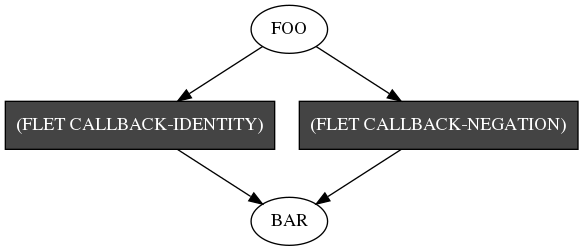
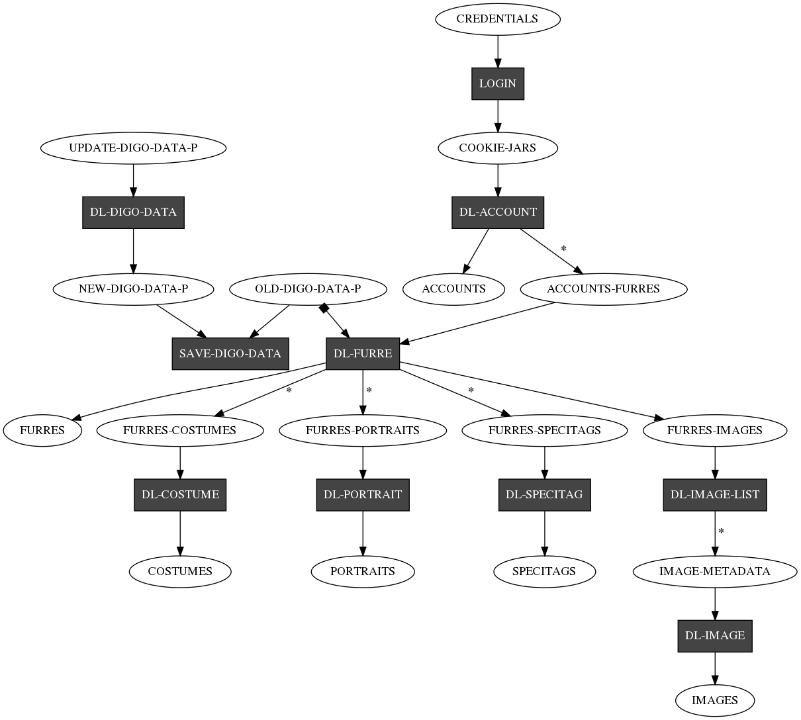

# PETRI

A Common Lisp implementation of
[Petri nets](https://en.wikipedia.org/wiki/Petri_net).

## Warning

This README is beta-quality. It will be fixed and extended one day.

## Introduction

The original Petri net notation mentions transitions and places. Because the
term "place" already has a defined meaning in Common Lisp, I have decided to
instead use the term "bag" in this library. The implementations of bags I use is
[`PHOE-TOOLBOX/BAG`](https://github.com/phoe/phoe-toolbox/) and all bags may be
queried using the interface defined in that system: `BAG-CONTENTS`,
`BAG-INSERT`, `BAG-REMOVE`, and `BAG-COUNT`.

Each Petri net is a funcallable object and invoking a Petri net happens via
funcalling it. A Petri net returns itself upon being funcalled.

The keyword arguments to a Petri net are:
* `:COMPRESS` - states whether the bags should be compressed after each Petri
net call;
* `:IGNORE-ERRORS` - states whether all errors should be silently ignored during
Petri net execution. This option is useful if error handling happens inside
transition functions via programmer code.

Petri nets are immutable after their creation. Their only mutable parts are the
bag objects referenced by them.

Each transition in the Petri net is specified by a list of input bag specs, a
list of output bag specs, and a callback function. Each bag spec A single bag
spec may be one of the following:

* a symbol, denoting a bag with the default count 1,
* a list in form of `(symbol count)`, denoting a bag with name `symbol` and
  count `count`.

In case of input bags, the count denotes how many tokens must be present in a
bag for the transition to fire. When a transition fires, these tokens are
automatically removed from the bag and passed to the callback by means of an
input hash table, where the keys are bag names and values are lists of tokens .

In case of output bags, the count denotes how many tokens must be pushed by the
callback into the output hash table under the key being the bag's hash table. If
the number of tokens pushed by the transition does not match the spec, an
execution-time error is signaled.

A special kind of an input bag spec is a list in form of `(symbol !)`, where `!`
is any symbol with name `"!"`. This spec denotes an inhibitor edge, meaning that
the bag with the name `symbol` must be empty in order for the transition to
fire.

A special kind of an output bag spec is a list in form of `(symbol *)`, where
`*` is any symbol with name `"*"`. This spec denotes a wildcard edge, meaning
that the transition may push any amount of tokens to the bag with the name
`symbol`.

Each callback is a function that must accept a pair of arguments: an input hash
table and an output hash table. The input hash table provides input for the
callback and the output hash table is used for sending output. The return value
of the callback is ignored.

The input hash table is fresh may freely be mutated by the callback.

`PETRI` pre-creates the keys in output hash table, so the callback is allowed to
access the keys of that hash table in order to determine how to behave. In
particular, the callback is allowed to do nothing in order to be considered
valid.

`PETRI` solves the nondeterminism of Petri nets by means of random selection.
Each time the code searches for an available transition, all transitions are
searched in random order. Each time a token is removed from a bag, it is removed
at random.

Execution of a Petri net stops when no more transitions are available to fire.
In particular, this means that calling a Petri net may loop indefinitely.

## ASDF systems

### PETRI

This ASDF system defines the base code implementing Petri nets.

A Petri net (an instance of class `PETRI-NET`) may be created in two ways: using
functional syntax (via the `MAKE-PETRI-NET` function) and using declarative
syntax (via the `PETRI-NET` macro.) An individual bag of a Petri net may be
accessed using the `BAGS-OF` function, which accepts a Petri net and the name of
the bag in question. A list of all bag names may be accessed via `BAG-NAMES`.

Condition types defined by this system are `PETRI-NET-ERROR`, which is the
supertype of all errors related to Petri nets, and `SIMPLE-PETRI-NET-ERROR`,
which is a `PETRI-NET-ERROR` that is also a `SIMPLE-ERROR`. The convenience
function `PETRI-NET-ERROR` exists for signaling this error.

### PETRI/THREADED

This ASDF system contains code for a multithreaded implementation of Petri net
that uses raw `BORDEAUX-THREADS` for execution. Each transition is executed in a
separate thread as soon as enough tokens are available for it to fire.

Instances of threaded Petri nets (instances of class `THREADED-PETRI-NET`) may
be created using the `THREADED-PETRI-NET` macro or the `MAKE-THREADED-PETRI-NET`
function.

Errors cause the transition to return and are propagated to the thread calling
the Petri net along with the backtrace, wrapped in a condition of type
`THREADED-PETRI-NET-ERROR`.

### PETRI/GRAPH

This ASDF system contains code for integrating `PETRI` with `CL-DOT`.

Loading this system defines methods on the generic functions in `CL-DOT`'s
`GRAPH-OBJECT` protocol that allow Petri nets to be graphed.

The only symbol exported by this package is `DISPLAY-GRAPH`, a convenience
function which accepts a Petri net, generates a PNG graph in a temporary
directory and automatically executes it using `xdg-open`.

### PETRI/TEST

This ASDF system contains tests for `PETRI` and `PETRI-THREADED`.

You do not need to explicitly load this system to run the tests; instead, use
`(asdf:test-system :petri)`.

See the file [tests.lisp](tests.lisp) for working examples in form of unit
tests. Each working test is run in four manners: using functional and
declarative syntax, and using single-threaded and multithreaded implementations.

## Examples

### Negation

```common-lisp
;; Define the callback function for the transition.
(flet ((callback (input output)
         (push (- (pop (gethash 'foo input))) (gethash 'bar output))))
  ;; Create the petri net object.
  (let ((petri-net (make-petri-net
                    ;; Define bags FOO and BAR.
                    '(foo bar)
                    ;; Define a single transition which takes one token from FOO
                    ;; and outputs one token to BAR.
                    `((((foo 1)) ((bar 1)) ,#'callback)))))
    ;; Populate bag FOO with data.
    (dolist (i '(1 2 3))
      (bag-insert (bag-of petri-net 'foo) i))
    ;; Funcall the Petri net.
    (funcall petri-net)
    ;; Access the contents of bag BAR.
    (bag-contents (bag-of petri-net 'bar))))
;; => #(-1 -3 -2)
```


Due to the non-determinism of the Petri net, the output vector may have its
elements in any order.

### Maybe-negation

```common-lisp
;; Define the callback functions for the transition: one which negates its
;; arguments and the other which passes them without any change.
(flet ((callback-negation (input output)
         (push (- (pop (gethash 'foo input))) (gethash 'bar output)))
       (callback-identity (input output)
         (push (pop (gethash 'foo input)) (gethash 'bar output))))
  ;; Create the petri net object.
  (let ((petri-net (make-petri-net
                    ;; Define bags FOO and BAR.
                    '(foo bar)
                    ;; Define two transitions:
                    ;; * one that takes one token from FOO, outputs one token to
                    ;;   BAR, and calls CALLBACK-IDENTITY,
                    ;; * one that takes one token from FOO, outputs one token to
                    ;;   BAR, and calls CALLBACK-NEGATION.
                    `((((foo 1)) ((bar 1)) ,#'callback-negation)
                      (((foo 1)) ((bar 1)) ,#'callback-identity)))))
    ;; Populate bag FOO with data.
    (dolist (i '(1 2 3 4 5 6 7 8 9 0))
      (bag-insert (bag-of petri-net 'foo) i))
    ;; Funcall the Petri net.
    (funcall petri-net)
    ;; Access the contents of bag BAR.
    (bag-contents (bag-of petri-net 'bar))))
;; => #(-1 -9 -3 8 -4 5 0 6 -2 -7)
;; => #(-5 8 0 2 -4 -9 -3 -1 -7 -6)
;; => #(-4 -8 -1 -2 -5 -7 -6 3 0 9)
;; => ...
```



Due to the non-determinism of the Petri net, the output vector may have its
elements in any order, and any element might have been negated.

### Graphs

A more complex Petri net may be visualized using the `PETRI/GRAPH` system.

```common-lisp
(petri/graph:display-graph
 (petri-net ()
   (credentials -> #'login -> cookie-jars
                -> #'dl-account
                -> accounts accounts-images accounts-furres)
   (accounts-images -> #'dl-images -> (images *))
   (accounts-furres -> #'dl-furres
                    -> (furres *)
                       (furres-for-costumes *)
                       (furres-for-portraits *)
                       (furres-for-specitags *))
   (furres-for-costumes -> #'dl-costumes -> costumes)
   (furres-for-portraits -> #'dl-portraits -> portraits)
   (furres-for-specitags -> #'dl-specitags -> specitags)))
```



In the above example, the programmer's intent was to store input in the
`CREDENTIALS` bag read and output from bags `ACCOUNTS`, `IMAGES`, `FURRES`,
`COSTUMES`, `PORTRAITS`, and `SPECITAGS` when the Petri net finishes executing.
Each transition accepts one token from the input bag and store either one token
into each output bag (edges without labels) or an arbitrary number of tokens
into each output bag (edges labeled with `*`).

## Extending PETRI

This system is currently not designed to be extensible. See the class
definitions and generic functions defined in the file `petri.lisp` for details
on the internal working of the system.

## License

Copyright © 2018 Michał "phoe" Herda.

Permission is hereby granted, free of charge, to any person
obtaining a copy of this software and associated documentation
files (the “Software”), to deal in the Software without
restriction, including without limitation the rights to use,
copy, modify, merge, publish, distribute, sublicense, and/or sell
copies of the Software, and to permit persons to whom the
Software is furnished to do so, subject to the following
conditions:

The above copyright notice and this permission notice shall be
included in all copies or substantial portions of the Software.

THE SOFTWARE IS PROVIDED “AS IS”, WITHOUT WARRANTY OF ANY KIND,
EXPRESS OR IMPLIED, INCLUDING BUT NOT LIMITED TO THE WARRANTIES
OF MERCHANTABILITY, FITNESS FOR A PARTICULAR PURPOSE AND
NONINFRINGEMENT. IN NO EVENT SHALL THE AUTHORS OR COPYRIGHT
HOLDERS BE LIABLE FOR ANY CLAIM, DAMAGES OR OTHER LIABILITY,
WHETHER IN AN ACTION OF CONTRACT, TORT OR OTHERWISE, ARISING
FROM, OUT OF OR IN CONNECTION WITH THE SOFTWARE OR THE USE OR
OTHER DEALINGS IN THE SOFTWARE.
